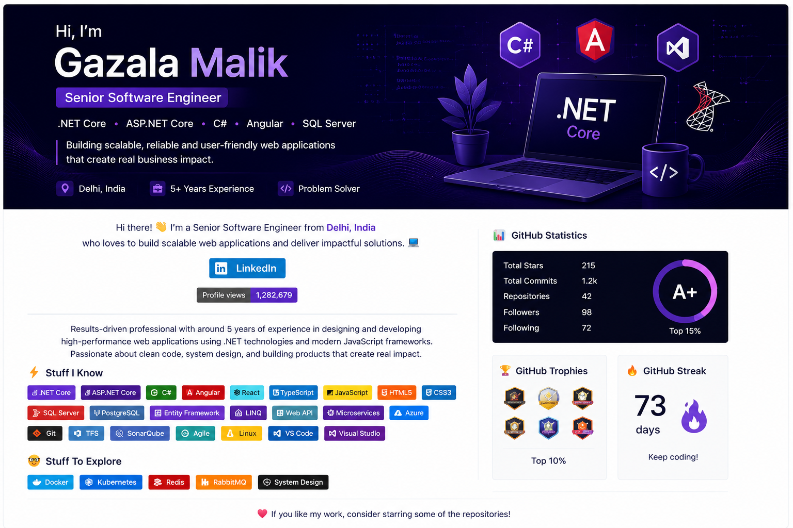

  

<h2 align="center">Hi there! 👋 I'm Gazala Malik</h2>

Senior Software Engineer • .NET Full Stack Developer

📍 Delhi, India &nbsp;&nbsp;|&nbsp;&nbsp; 💼 Around 5 Years Experience

Passionate about building scalable enterprise web applications using
<strong>.NET Core</strong>, <strong>ASP.NET Core</strong>,
<strong>C#</strong>, <strong>Angular</strong> and
<strong>SQL Server</strong>.

---

## ⚡ Stuff I Know

---

## 🤓 Stuff To Explore

---

## 👨‍💻 Projects & GitHub

📊 GitHub Stats

 

🏆 GitHub Trophies

 

🔥 GitHub Streak

 

---

⭐ If you like my work, consider starring my repositories!

